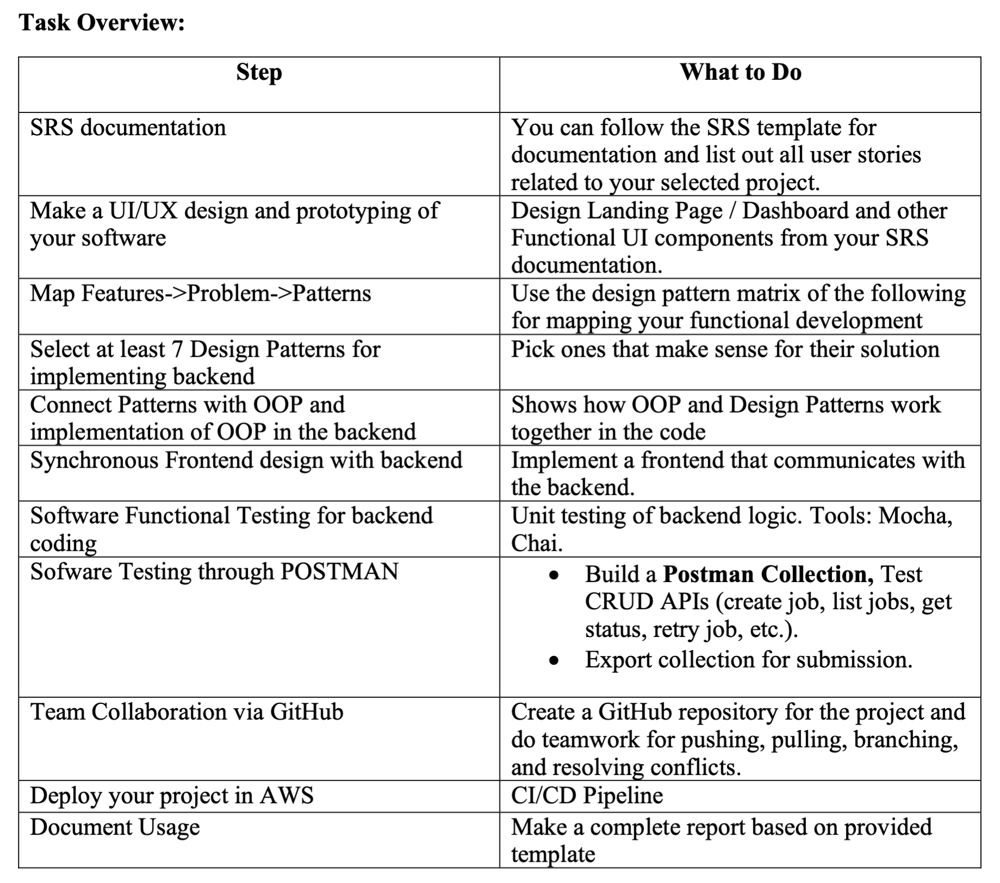
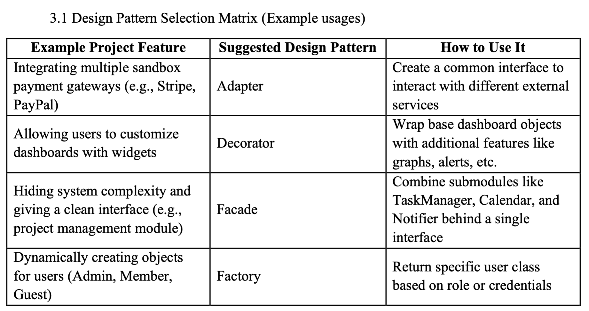
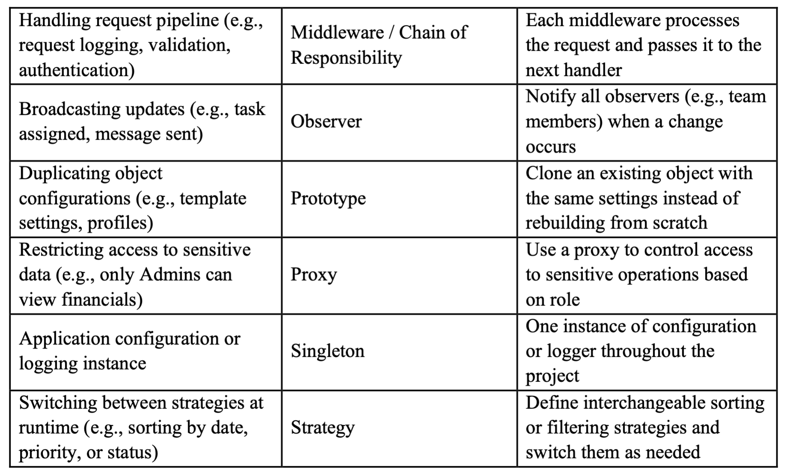
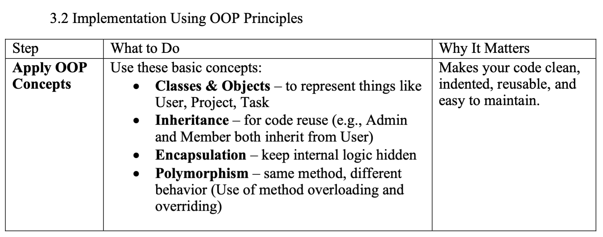

# QUT-MIT Learning Progress Tracker

A comprehensive learning management system for tracking educational progress and achievements.

## 🚀 Quick Start Guide

### Prerequisites
- Node.js (v14 or higher)
- MongoDB (local or cloud instance)
- npm or yarn

### Installation & Setup

1. **Clone the repository**
   ```bash
   git clone https://github.com/rai-12300063/Online-Learning-Progress-Tracker.git
   cd Online-Learning-Progress-Tracker
   ```

2. **Install dependencies**
   ```bash
   npm run install-all
   ```

3. **Configure environment**
   ```bash
   # Copy .env.example to .env in backend folder
   cp backend/.env.example backend/.env
   # Edit backend/.env with your MongoDB URI and JWT secret
   ```

4. **Start the development servers**
   ```bash
   npm run dev
   ```
   This will start:
   - Backend server on `http://localhost:5001`
   - Frontend React app on `http://localhost:3000`

5. **Project URL**
   ```bash
   [Online Learning Progress Tracker](http://54.66.53.65/)
   ```
   Access:
   - Username: `test@example.com`
   - Password `password123`

### API Endpoints
- **Authentication**: `/api/auth/*`
- **Tasks**: `/api/tasks/*`
- **Courses**: `/api/courses/*`

### Testing
```bash
cd backend && npm test
```
---
Assignment Objective:
To simulate the real-world software development lifecycle by collaboratively designing, developing, and deploying an object-oriented application using advanced OOP concepts, popular design patterns, software testing, and GitHub for version control. The project will also involve creating a Software Requirements Specification (SRS) documentation and UI/UX prototyping
using Figma.

Task Overview:


Task 1: Software Requirements Specification (SRS)
Write a Software Requirements Specification (SRS) document that includes:
o Purpose – Why the system is being developed.
o Problem Statement
o Scope – Overview of the product, its goals, and benefits.
o User Characteristics – Target users and their needs.
o Constraints – Limitations like regulatory, hardware, or technology
restrictions.
o Functional Requirements – Detailed description of system functions (e.g.,
“The system shall allow users to log in with email and password”).
o Non-Functional Requirements (NFRs) – Performance, reliability, security,
usability, scalability.
o User interface mockups/wireframes (Low Fidelity Design)
o Complete System Diagram
o Safety Considerations.
o Risk Management

Task 2: UI/UX Design and Prototyping Using Figma - 8
• Based on the SRS and Low Fidelity Design, design the User Interface (UI) in Figma.
• Share the link with your peers and collaborate (we will check individual contributions).
• Do prototyping on your design and share the production level URL in the report
• Share the link to the Figma project in report.

Task 3: Implementation (Coding) Using Design Pattern and OOP Principles Using the following Matrix. (You must extend two more epics in your group project)



You Must include:
• At least 5 interacting classes with the implementation of OOP principles (inherence,
polymorphism, encapsulation, abstraction). Each class should implement at least one
OOP principals.
• Use of at least 7 design patterns
• In report, you must explain the following:
OOP Explanation:
o -Why you defined each class
o -Where inheritance is used
o -How encapsulation is applied
o -Where polymorphism appears
Design Pattern Explanation:
o Which 7 patterns were used
o Where they are used in your code
o Why each pattern fits your problem

Task 4: Team Collaboration via GitHub
• Create a new GitHub repository for the project
• Share your project to your team members
• Use branches for feature development
• Use pulls requests and code reviews for other members of your project
• Practice merging conflicts and mention it in the report (Minimum 2)
• Maintain a README.md with setup instructions
• We will check all commits which are initiated by different team members.

Task 5: Functional Testing (only unit testing)
• Test each of your backend functionality (such as create task, update task, etc.) using unit
testing

Task 6: API Testing using Postman
• Test the endpoint of your backends functionality using Postman
• Screenshots of Postman test cases or Swagger documentation (If we cover)
Example Endpoints to Test (It must be based on your project):
• POST /login
• GET /users
• POST /notifications
• PUT /settings/{id}
• DELETE /account/{id}
• And other functionality as well

Task 7: CI/CD Pipeline


